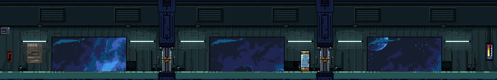

# GameDev
Repository made to sync files for Game Development in Unity

Unity version: `2021.3.8f1`

## For Developers:
1. Pick from github issues a task to work on
2. Create a new branch off of master for each new task and create a PR once a task is complete
3. PR will be reviewed and if approved will be merged with master
3. Please remove branch after merging with master

- name your branches as follows:
feature-[*_name_of_feature_*]
fix-[*_name_of_fix_*]
refactor-[*_name_of_refactor_*]

Keep commit messages brief but descriptive of the task

------------------------------------------------------------

For script documentation, visit https://1liale.github.io/GameDev/html/annotated.html

